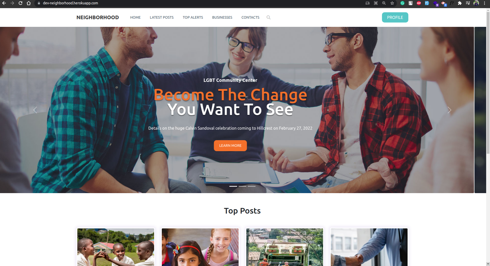
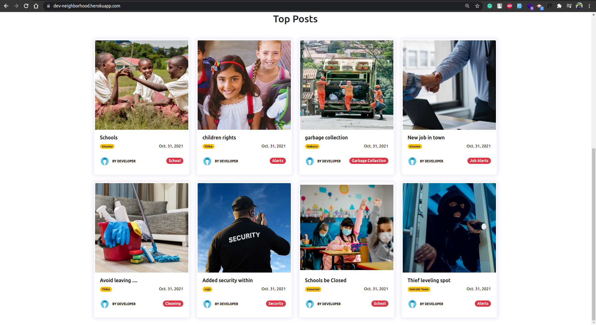
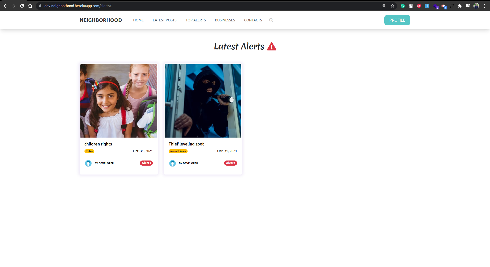
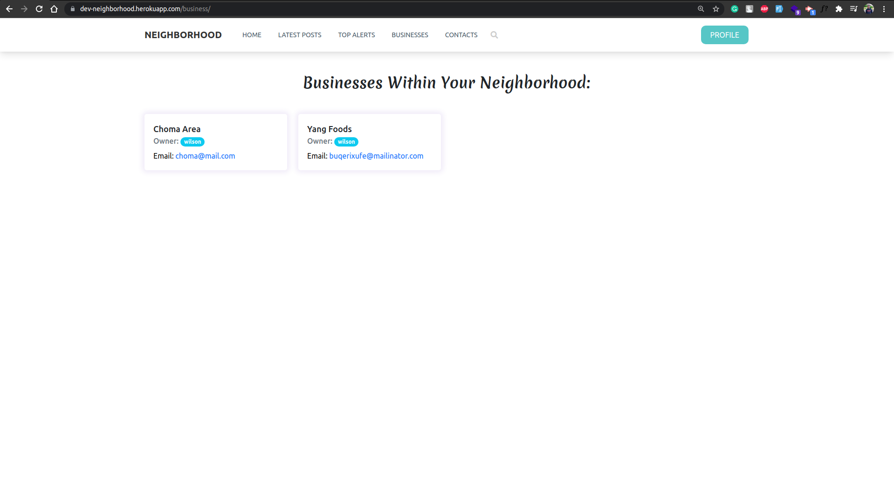
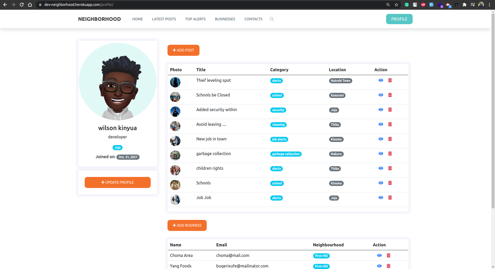
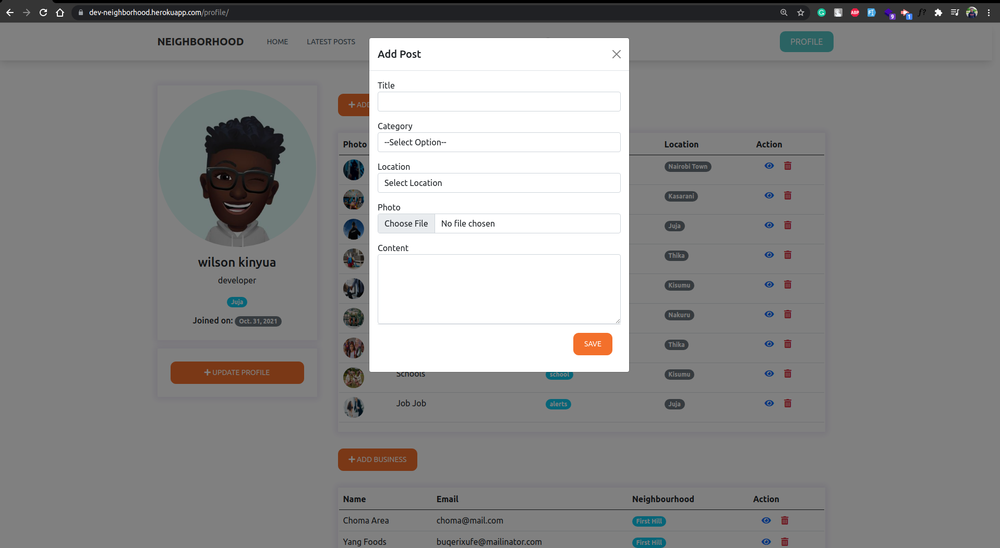

# Neighborhood

#### Created By Wilson Kinyua Muthoni on 31-10-2021

## Description

Neighborhood is a simple web application that allows you to be in the loop about everything happening in your neighborhood. From contact information of different handyman to meeting announcements or even alerts.

## Setup Requirements

- Git
- Web-browser or your choice
- Github
- Django 3.2.7
- Pip
- Python 3.8
- PostgreSQL
- Cloudinary (for image upload)

```
   - CLOUD_NAME
   - API_KEY
   - API_SECRET
```

## Setup Installation

- Copy the github repository url
- Clone to your computer
- Open terminal and navigate to the directory of the project you just cloned to your computer
- Run the following command to start the server using virtual environment

```
python3.8 -m venv --without-pip virtual
```

- To activate the virtual environment

```
source virtual/bin/activate
```

```
curl https://bootstrap.pypa.io/get-pip.py | python
```

```
pip install -r requirements.txt
```

- To copy .env.example to .env

```
cp .env.example .env
```

- Edit the .env file and replace the values with your own Cloudinary credentials and database credentials

- To run the server

```
python manage.py runserver

```

- Open the browser and navigate to http://127.0.0.1:8000/ to see the application in action

## Technologies Used

The following languages have been used on this project:

- HTML
- CSS
- Bootstrap
- Python
- Django
- PostgreSQL

## Setup/Installation Requirements

- Live link to view the project <a target="_blank" href="https://dev-neighborhood.herokuapp.com/">View Neighborhood</a>

## Some Screenshots

  

  

  

  

  

  

## Known Bugs

So far so good there are no bugs related to this project 😎

## Support and contact details 🙂

To make a contribution to the code used or any suggestions you can click on the contact link and email me your suggestions.

- Email: wilson@developerwilson.com
- Phone: +254717255460

## License

Copyright (c) 2021 Moringa school

Permission is hereby granted, free of charge, to any person obtaining a copy
of this software and associated documentation files , to deal
in the Software without restriction, including without limitation the rights
to use, copy, modify, merge, publish, distribute, sublicense, and/or sell
copies of the Software, and to permit persons to whom the Software is
furnished to do so, subject to the following conditions:

The above copyright notice and this permission notice shall be included in all
copies or substantial portions of the Software.

THE SOFTWARE IS PROVIDED "AS IS", WITHOUT WARRANTY OF ANY KIND, EXPRESS OR
IMPLIED, INCLUDING BUT NOT LIMITED TO THE WARRANTIES OF MERCHANTABILITY,
FITNESS FOR A PARTICULAR PURPOSE AND NONINFRINGEMENT. IN NO EVENT SHALL THE
AUTHORS OR COPYRIGHT HOLDERS BE LIABLE FOR ANY CLAIM, DAMAGES OR OTHER
LIABILITY, WHETHER IN AN ACTION OF CONTRACT, TORT OR OTHERWISE, ARISING FROM,
OUT OF OR IN CONNECTION WITH THE SOFTWARE OR THE USE OR OTHER DEALINGS IN THE
SOFTWARE.
